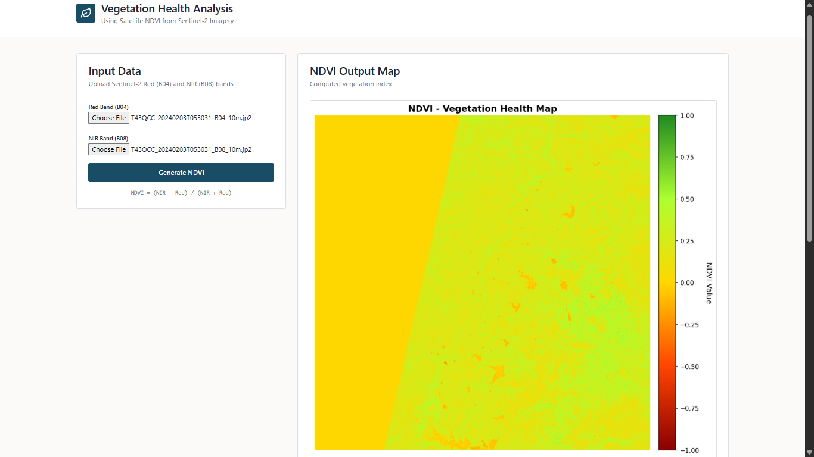
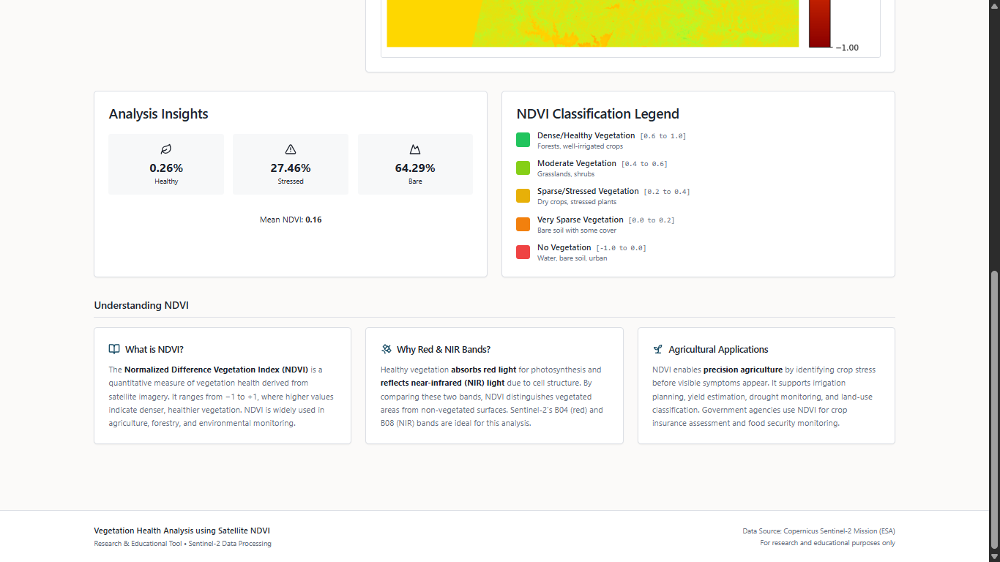

# NDVI-Based Vegetation Health Analysis

---

## Output

- NDVI vegetation health map
- Percentage of:
    - Healthy vegetation
    - Stressed vegetation
    - Non-vegetated areas

### Output Visual Results

Below are the sample outputs generated by the system and stored in the `Output` folder:

#### NDVI Vegetation Health Map

#### Vegetation Classification Map

---

## Limitations

- Optical satellite data is affected by cloud cover.
- NDVI may saturate in areas with dense vegetation.
- Single-date analysis does not capture temporal crop changes.

---

## Future Scope

- Multi-temporal NDVI analysis for crop growth monitoring
- Integration with weather and soil data
- Extension to other vegetation indices
- Automated anomaly detection using time-series analysis

---

## Academic Note

This project is intended for academic and research demonstration purposes  
and follows standard remote sensing practices used in satellite-based  
agriculture monitoring systems.
